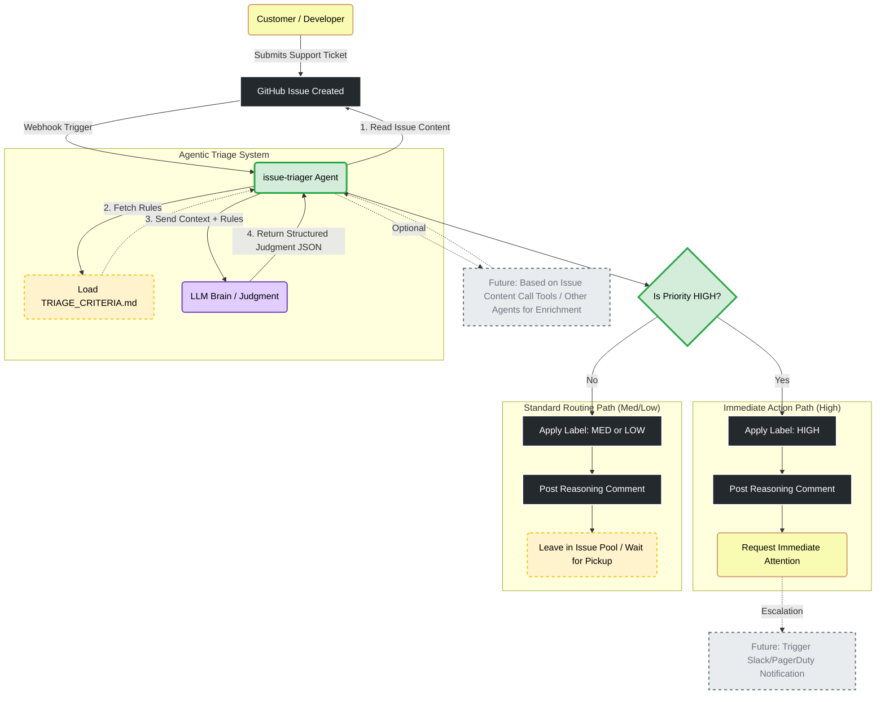

# issue-triager

Agentic triage bot for GitHub Issues. **issue-triager** is an AI agent designed to automate the initial classification of DevOps support tickets. It dynamically loads `TRIAGE_CRITERIA.md`, asks an LLM to identify the priority of the issue, applies the appropriate label and comment and take actions accordingly. It acts as an interface between the customer and the support team to identify which issues require immediate attention and which can stay in the queue waiting for pickup.

## The Problem Statement: The Triage Dilemma
In a fast-paced DevOps environment, the "Support Channel" repository often suffers from two triage dilemmas:

- **Manual Triage Delay**: If the Support Team is responsible for triage, they must context-switch constantly, or high-priority issues sit in the queue for too long.
- **Inconsistent User Triage**: If customers (developers) triage their own issues, they often lack the "big picture" (e.g., understanding how a failure in a shared network component affects the whole company), leading to either "over-triaging" (marking everything as High) or "under-triaging" (missing critical outages).

## The Solution: Agentic AI
Unlike a simple keyword-based script, an Agentic AI solution can:

- **Understand Long Context**: Interpret the nuance of an issue description.
- **Make Judgments**: Compare the issue against a dynamic, version-controlled Triage Criteria document.
- **Take Action**: Not just categorize, but perform API calls to label issues, leave explanatory comments, and push notifications when on-call attention is required, potentially identifying the risky behavior from the issue description and alerting the relevant stakeholders, or calling other agents to enrich the issue, enabling customer self-service.

## Architecture
- FastAPI webhook endpoint at `/webhook/github`.
- Dynamic context injection: `TRIAGE_CRITERIA.md` is read on every request.
- LLM backends: rules-based `MockLLM` (default, deterministic) or OpenAI ChatGPT when `OPENAI_API_KEY` is set.
- Safety: webhook signature verification (HMAC SHA256) when `WEBHOOK_SECRET` is configured; fallback guard for vague issues forces LOW priority and asks for details.
- Actions: DRY_RUN=true by default; live GitHub label/comment when DRY_RUN=false and `GITHUB_TOKEN` is provided. Notifications are logged only.

## Quickstart (local)
Prereqs: Python 3.11+ available as `python3`.

1) `cp .env.example .env` and adjust values (leave `WEBHOOK_SECRET` empty for local dev).
2) `make install`
3) `make run` (serves on `http://localhost:8080`)
4) `make eval` (golden dataset, must be 100% with the mock)
5) `make curl-demo` (sends a sample webhook payload locally using TC001 from the golden dataset; override with `DEMO_CASE_ID=TC002` etc.)

LLM selection:
- The server uses ChatGPT (via the official `openai` client) when `OPENAI_API_KEY` is set in the environment (or `.env`); otherwise it falls back to the deterministic MockLLM.
- `make eval` defaults to MockLLM for deterministic results. Set `USE_CHATGPT_FOR_EVAL=1 make eval` if you want to exercise ChatGPT instead.

## Testing
- `make test` runs pytest suite (signature verification, mock LLM golden dataset, vague issue guard, webhook smoke test).
- `make eval` prints accuracy + confusion matrix for `data/golden_dataset.json`.

## Webhook usage
- Endpoint: `POST /webhook/github`
- Headers: `X-GitHub-Event: issues`, `X-Hub-Signature-256` (required only if `WEBHOOK_SECRET` is set).
- Supported actions: `opened` (default). Other issue actions (e.g., `edited`, `closed`) are ignored with a 2xx response so GitHub deliveries stay green; adjust via `ALLOWED_ACTIONS` if you want more.
- If `TRIAGE_CRITERIA.md` is missing, the API returns 500 with a clear error.

## Real GitHub demo (via tunnel)
1) Start the server locally: `make run`.
2) Start a tunnel (ngrok): see `doc/ngrok.md` for install/auth/start steps.
3) In GitHub repo settings > Webhooks: see `doc/github-webhook.md` for exact form values.
4) Trigger issue opened/edited events. Codex cannot configure GitHub for you; paste the secret and URL yourself.

## DRY_RUN vs live actions
- Default `DRY_RUN=true`: response includes intended label/comment without calling GitHub.
- To enable live actions: set `DRY_RUN=false` and `GITHUB_TOKEN=<PAT with repo scope>`. The bot adds `priority:*` label and posts a comment summarizing reasoning and matched rules using PyGithub. See `doc/github-pat.md` for PAT setup.

## ChatGPT mode
- Set `OPENAI_API_KEY` (and optionally `OPENAI_MODEL`) to use ChatGPT instead of the mock.
- The LLM must return strict JSON; invalid responses fall back to a LOW priority result asking for more info.

## Local simulation via curl helper
- `make curl-demo` sends a demo payload to `WEBHOOK_URL` (defaults to `http://localhost:8080/webhook/github`). If `WEBHOOK_SECRET` is set, the script signs the request.

## Additional docs
- `doc/ngrok.md`: installing/configuring ngrok and starting a tunnel.
- `doc/github-webhook.md`: creating and testing the GitHub webhook for issue-triager.
- `doc/github-pat.md`: creating and configuring a GitHub Personal Access Token for live actions.

## Files of interest
- `app/main.py`: FastAPI webhook handler.
- `app/agent.py`: orchestration, validation, action plan.
- `app/llm/mock.py`: deterministic rules hitting 100% on the golden dataset.
- `app/llm/chatgpt.py`: minimal ChatGPT client.
- `app/webhook_security.py`: HMAC SHA256 verification.
- `data/golden_dataset.json`: evaluation cases TC001–TC030.
- `TRIAGE_CRITERIA.md`: triage policy loaded at runtime; edits here change behavior without code changes.
